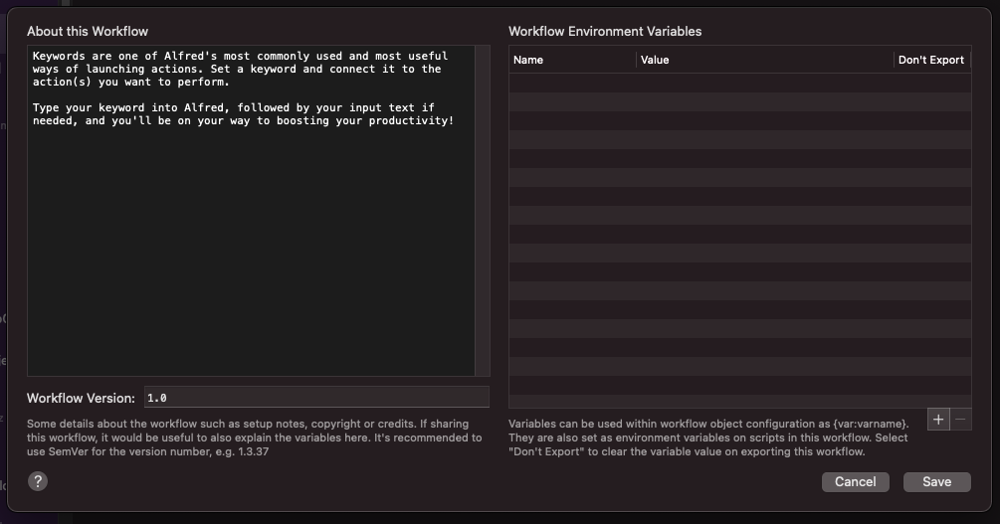
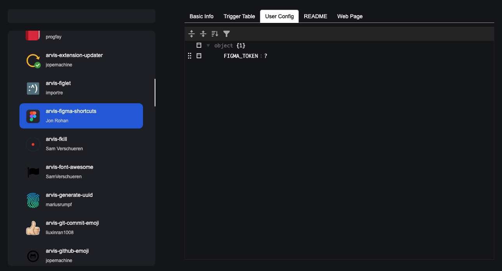

# About user config (variables)

Alfred support `workflow environment variable`.

And this variables are stored `info.plist.`

Because those variable are store in `info.plist`, workflow developers can register necessory variable (like API key) on those tab.

Then users of the workflow can simply put their values on the tab.

Arvis support `variables` on arvis-workflow.json config file.

But Arvis's variable values are store in separate file (as `user-config` file) at the same time.

And after the extension update, existing setting values are updated by the `user-config` file.

So extension developer can specify necessory variables to users,

And extension users simply change these variable values on user-config table of their preference window.

`user-config` file updated automatically whenever user changes their setting value on user-config table.

